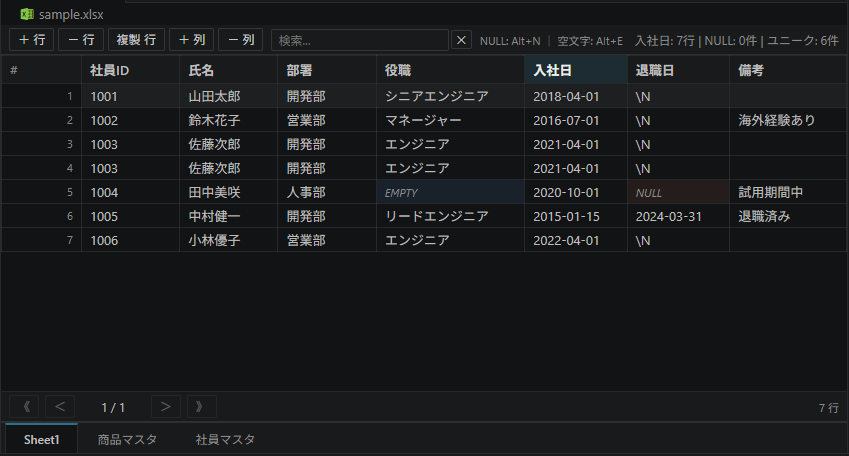

# Simple Excel Editor

A VS Code extension for editing Excel files (`.xlsx` / `.xlsm`) as a spreadsheet directly inside the editor.
Designed primarily for creating and editing test data for Java-based DBRider / DBUnit workflows.



---

## Features

### Cell Editing

Double-click any cell to enter edit mode. Press **Enter** to commit, **Escape** to cancel, or **Tab** / **Shift+Tab** to move to the next/previous cell.

### Header Editing

Double-click a header cell to rename the column name inline.

### Multi-sheet Support

Click the sheet tabs at the bottom of the editor to switch between sheets.

### Row & Column Operations

Use the toolbar buttons to add or delete rows and columns.  
To **duplicate** a selected row, press **Ctrl+D** — the row is inserted immediately below.

### Sorting

Click a column header to sort rows in ascending order. Click again to toggle to descending order.

### Search / Filter

Type in the search box on the toolbar to filter rows in real time. The status bar shows how many rows match.

### Pagination

Rows are displayed in pages (default: 200 rows per page). Use the **◀ Prev** / **Next ▶** buttons to navigate.  
The page size can be changed in [Settings](#settings).

### Sheet Management

| Operation | How to perform |
|-----------|---------------|
| Create sheet from rows | Select rows → right-click → **"Create sheet from selected rows"** |
| Rename sheet | Double-click the tab, or right-click → **"Rename sheet..."** — edit inline, press Enter to confirm or Escape to cancel |
| Delete sheet | Right-click the tab → **"Delete sheet"** (confirmation dialog shown; cannot delete if only one sheet remains) |
| Reorder sheets | Drag and drop a tab to a new position, or right-click → **"← Move left"** / **"Move right →"** |

Sheet order is reflected in the saved Excel file.

### CSV Support

| Operation | How to perform |
|-----------|---------------|
| Open CSV directly | Open any `.csv` file — a **table icon** appears in the editor title bar; click it to open the file in Simple Excel Editor |
| Import CSV as a new sheet | Click **"Add CSV"** on the toolbar → select a file |
| Export all sheets to CSV | Click **"Export CSV"** on the toolbar → choose an output folder. A `table-ordering.txt` is generated automatically. If any `{sheet}.csv` already exists in the folder, the export is cancelled before writing. |

### table-ordering.txt

Create a plain text file named `table-ordering.txt` where each line is a relative path to a CSV file.  
Opening this file in VS Code loads all the listed CSV files as individual sheets in a single multi-sheet view.  
Lines starting with `#` are treated as comments and ignored.

### Row Grouping

Rows can be grouped using a column whose header is **blank** (an empty column name).  
Enter a value in the format `[GroupName]` (e.g. `[Happy path]`) in that column to mark the row as a group header.

- Click the **▶ Grouped** toggle in that row to expand or collapse all rows belonging to that group.
- Each group is highlighted with a distinct background color.
- Use the **Group filter** dropdown in the toolbar to show only a specific group.
- When adding a new row, the group column value is automatically copied from the selected row.

Enable or disable this feature with `simpleExcelEditor.enableRowGrouping` in [Settings](#settings).

### Cross-Sheet FK Navigation

When a single cell is selected, the toolbar automatically shows a **"→ Navigate in [SheetName]"** button if another sheet has a column with the same name.  
Clicking the button switches to that sheet and highlights all rows where the column value matches the selected cell.

If multiple sheets have a matching column, a dropdown button appears instead.  
Selecting any new cell clears the highlight.

### NULL / EMPTY String Distinction

The editor explicitly distinguishes between SQL **NULL** and an **empty string** — a key requirement for DBRider / DBUnit datasets.

| Type | Display | Default marker | Keyboard shortcut |
|------|---------|----------------|-------------------|
| NULL | Red background + `NULL` label | `[null]` | `Alt+N` |
| Empty string | Teal background + `EMPTY` label | `[empty]` | `Alt+E` |
| Blank cell | (blank) | `""` | — |

The marker strings are configurable via `simpleExcelEditor.nullMarkers` / `simpleExcelEditor.emptyMarkers`.

### Date Validation

Columns whose name contains `date`, `day`, `_on`, or `_at` are treated as date columns.  
Any cell that does not match the ISO format (`yyyy-MM-dd` or `yyyy-MM-dd HH:mm:ss`) is highlighted with a light-red background as a warning.

### Column Statistics

Click a column header (or any cell in a column) to select the column.  
The status bar at the bottom shows:

```
column_name: 10 rows | NULL: 2 | Empty: 1 | Unique: 7
```

### Language Support

The UI language can be controlled via the `simpleExcelEditor.language` setting:

| Value | Behavior |
|-------|----------|
| `"auto"` (default) | Follows the VS Code display language |
| `"en"` | Always English |
| `"ja"` | Always Japanese |

Changes take effect the next time a file is opened in the editor.

### New Excel File

Open the Command Palette and run **"Simple Excel Editor: New Excel File"** (Japanese: **"新規 Excel ファイルを作成"**).  
A save dialog appears — choose a folder and filename (`.xlsx`). An empty workbook with one sheet (`Sheet1`) is created and immediately opened in the editor.

### Settings

Click the **⚙** button on the right end of the toolbar, or open the Command Palette and run **"Simple Excel Editor: Open Settings"**.

---

## Requirements

### For users (installing from VS Code Marketplace)

- [Visual Studio Code](https://code.visualstudio.com/) 1.80 or later

No Java, no Node.js, no additional runtime required. Excel I/O is handled by [ExcelJS](https://github.com/exceljs/exceljs) (MIT), which is bundled inside the extension.

> **Note:** `.xls` (Excel 97–2003 binary format) is not supported. Please use `.xlsx` or `.xlsm`.

### For developers (building from source)

- Node.js (v20 or later)

---

## Development Setup

```bash
npm install
```

Open this folder in VS Code and press **F5** to launch the Extension Development Host.

```bash
# Type-check + bundle (extension host + webview)
npm run compile

# Watch mode (use alongside F5)
npm run watch

# Run unit tests
npm test

# Package as .vsix
npm run package
```

---

## Settings

| Setting | Default | Description |
|---------|---------|-------------|
| `simpleExcelEditor.nullMarkers` | `["[null]"]` | Strings to treat as SQL NULL |
| `simpleExcelEditor.emptyMarkers` | `["[empty]"]` | Strings to treat as empty string |
| `simpleExcelEditor.pageSize` | `200` | Number of rows per page |
| `simpleExcelEditor.hasHeader` | `true` | Treat the first row as a header |
| `simpleExcelEditor.enableRowGrouping` | `true` | Enable the row grouping feature |

---

## Keyboard Shortcuts

| Key | Action |
|-----|--------|
| `Alt+N` | Insert NULL marker into selected cell(s) |
| `Alt+E` | Insert empty-string marker into selected cell(s) |
| `Ctrl+D` | Duplicate selected row below |
| `Ctrl+S` | Save |
| `Escape` | Cancel edit / clear selection |
| `Tab` / `Shift+Tab` | Move to next / previous cell while editing |
| `Enter` | Commit edit |

---

## Project Structure

```
simple-excel-editor/
├── src/
│   ├── extension.ts            # Entry point
│   ├── ExcelEditorProvider.ts  # Custom editor provider
│   ├── ExcelDocument.ts        # Document model
│   ├── CsvUtils.ts             # CSV parse / serialize
│   ├── excel/
│   │   ├── IExcelIO.ts         # Excel I/O interface
│   │   └── ExcelJsIO.ts        # ExcelJS implementation
│   └── test/
│       └── CsvUtils.test.ts    # Unit tests (Mocha + ts-node)
├── media/
│   ├── editor.js               # Webview UI (bundled by esbuild)
│   └── editor.css              # Styles (VS Code theme variables)
├── tsconfig.json
├── tsconfig.build.json
└── tsconfig.test.json
```

---

## License

MIT
